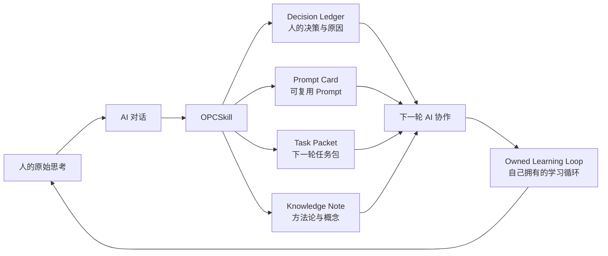
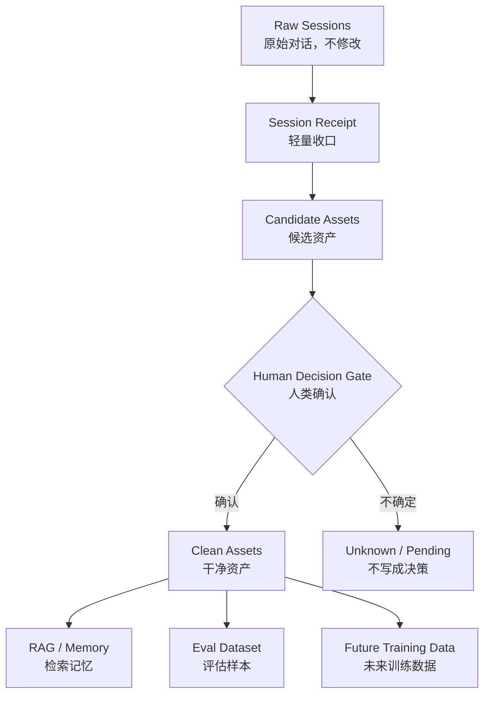
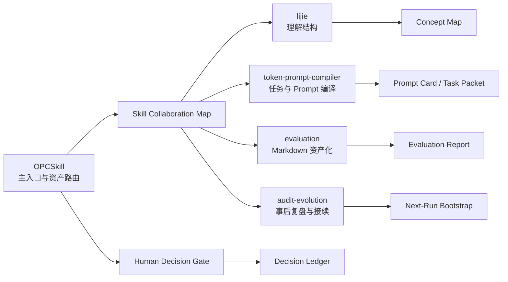

# OPCSkill

AI 的回答可以重来，人的判断不能丢。

OPCSkill 是一个面向一人公司的 AI Skill。它帮助你把和 AI 的关键对话，整理成自己拥有的学习循环：人的决策、决策原因、被拒绝的选项、可复用 Prompt、任务包、知识笔记和下一轮接续说明。

## 为什么需要它

很多 AI 对话用完就散了。

真正有价值的往往不是模型说了什么，而是你在对话里形成了什么判断：

- 我为什么选择这个方向？
- 我为什么放弃另一个方案？
- 哪个 Prompt 模式真的有效？
- 哪个任务可以交给 Agent？
- 哪个判断需要下次复查？
- 这次讨论应该沉淀成什么资产？

OPCSkill 的目标，是把这些判断从聊天窗口里保留下来，变成一人公司自己的资产。

## 核心循环



## 它会产出什么

| 资产 | 用途 |
|---|---|
| `Decision Ledger` | 记录人的决策、原因、证据、被拒绝选项和复查触发条件 |
| `Prompt Card` | 保存可复用 Prompt，以及适用场景和使用限制 |
| `Task Packet` | 把模糊想法转成可交给 AI worker 的任务包 |
| `Knowledge Note` | 提取概念、机制、方法论和可复用经验 |
| `Next-Run Bootstrap` | 让下一轮 AI 对话不用从头解释 |

## 它不是简单 RAG

OPCSkill 首先是一条对话资产化数据管线，RAG、eval 或训练只是后续用途。



原则：

- `Raw Sessions` 不修改。
- `Clean Assets` 可复用。
- `human_decision` 必须有证据或用户确认。
- RAG / eval / training 默认不自动发生，必须由用户显式决定。

## 核心原则

### 1. 人的决策优先

OPCSkill 不会把模型建议直接当成人的决策。

只有当用户明确表达“我决定”“我选择”“我不要”“就这样”“可以按这个来”等选择、拒绝或确认时，才会记录为 `human_decision`。

其他内容会标记为：

```text
model_proposal
inferred
unknown
```

### 2. 不是保存所有对话

不是所有聊天都值得沉淀。

OPCSkill 只关注可复用资产：

- 决策
- 原因
- 取舍
- Prompt
- 任务包
- 开放问题
- 下一步

### 3. 本地优先

默认不上传、不训练、不联网。

原始对话是你的私有数据。如果后续要进入 RAG、评估集或训练数据，应该由你显式决定。

## 快速使用

```text
使用 OPCSkill，把下面这段 AI 对话整理成可复用的一人公司资产。

请重点提取：
1. 我的真实决策
2. 决策原因
3. 被拒绝的选项
4. 可复用 Prompt
5. 下一轮 Task Packet
6. Next-Run Bootstrap

[粘贴对话]
```

## 输出示例

```yaml
decision_ledger:
  decision:
  decided_by: human | model_proposal | inferred | unknown
  reason:
  evidence_quote:
  rejected_options:
  expected_result:
  observed_result:
  next_review_trigger:
  do_not_claim:

reusable_assets:
  prompt_card:
  task_packet:
  knowledge_note:
  next_run_bootstrap:

open_loops:
  - question:
    owner:
    next_action:
```

## 安装

Windows:

```powershell
git clone https://github.com/aDragon0707/opcskill.git C:\Users\<YOU>\.codex\skills\opcskill
```

macOS / Linux:

```bash
git clone https://github.com/aDragon0707/opcskill.git ~/.codex/skills/opcskill
```

安装后，可以直接用“使用 OPCSkill...”触发。

## 和其他 Skill 的关系

OPCSkill 可以和已有 skill 协作，但不强依赖它们：



| 需要 | 可协作 skill |
|---|---|
| 理解概念结构 | `lijie` |
| 编译 Prompt / Task Packet | `token-prompt-compiler` |
| 整理成 Markdown 报告 | `evaluation` |
| 事后复盘和接续 | `audit-evolution` |

如果这些 skill 不存在，OPCSkill 会使用内置的简化流程。

## 判断一次输出是否合格

一次合格的整理应该能回答：

- 这段对话为什么值得保留？
- 用户真正做了什么决策？
- 决策依据是什么？
- 哪些只是模型建议？
- 有哪些可复用 Prompt 或任务包？
- 下一轮 AI 应该从哪里继续？
- 哪些结论还不能对外宣称？

## Roadmap

- v0.1：单段对话 -> 可复用资产
- v0.2：真实高价值样本 examples
- v0.3：批量 session 索引
- v0.4：RAG-ready clean assets
- v0.5：决策提取准确率 eval

