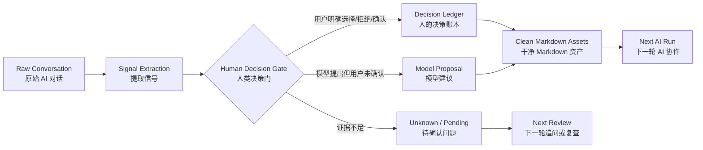
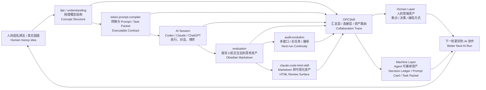
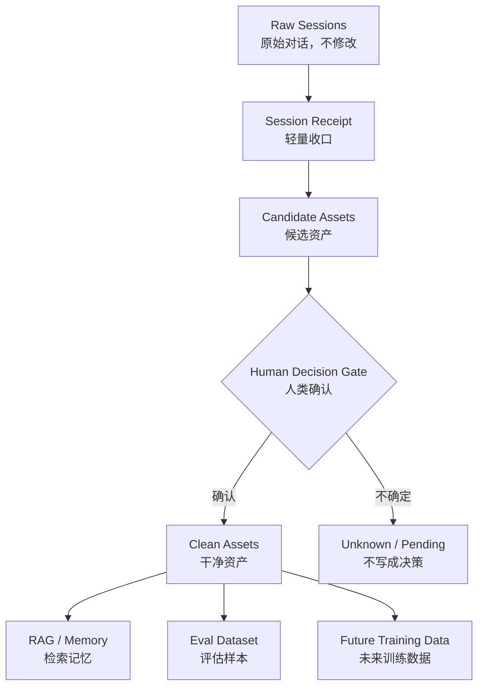
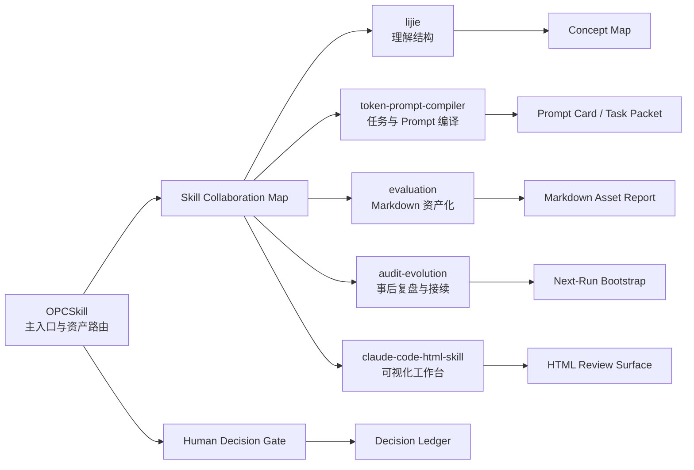

# OPCSkill

> AI 的回答可以重来，人的判断不能丢。

OPCSkill 是一个面向一人公司和高强度 AI 协作者的 skill。它不只是总结聊天记录，而是把散落在 Codex、Claude、ChatGPT 窗口里的关键对话，整理成你自己拥有、可以复用、可以持续迭代的学习资产。

它的核心产出不是一段“摘要”，而是一组可继续使用的资产：

```text
人的决策 -> 决策原因 -> 证据片段 -> 被拒绝选项 -> 可复用 Prompt -> 下一轮任务包
```

v0.3 开始，OPCSkill 还会优先保存人的思维运动：

```text
原来的理解 -> 思维断点 -> 破局动作 -> 新理解 -> 可复用方法
```

这意味着它不会只问“用户最后决定了什么”，还会问“用户是怎么从不会到会、从误判到重建、从混乱到方法的”。

## 30 秒看懂

OPCSkill 做的是一条对话资产化管线：



一句话：OPCSkill 先把对话变成可信资产，再让这些资产进入下一轮 AI 协作。

## 五步协作闭环：人类发起，Skill 协作，OPCSkill 汇总

OPCSkill 可以独立运行；但它真正适合做的是一人公司 Skill Stack 的汇总层、连接层和资产路由层。主线不是“AI worklog 很多”，而是人类先发起工作：想法混乱、目标不清、任务需要执行、执行后又产生了值得保存的思考资产。

五个 companion skills 各自处理一个阶段，OPCSkill 把这些阶段的输入、输出、证据、决策和下一轮接续统一整理成资产。



| 阶段 | Skill | 负责什么 | OPCSkill 汇总什么 |
|---|---|---|---|
| 1 | `lijie` | 帮人把混乱想法梳理成概念结构 | 原始困惑、结构化理解、未解决问题 |
| 2 | `token-prompt-compiler` | 把理解转换成可执行 Prompt / Task Packet | 任务边界、验证方式、stop rules |
| 3 | `evaluation` | 保存人和 AI 交互博弈后的思考资产 | Human Layer、证据、思维断点、可复用经验 |
| 4 | `audit-evolution` | 支持多窗口、长任务、复盘和接续 | next-run bootstrap、风险、连续性记录 |
| 5 | `claude-code-html-skill` | 把 Markdown 真源转成可视化审查界面 | HTML 只作为 review/export surface 的边界 |

### 实战案例（公开安全版本）

| 案例 | 真实问题 | 穿过闭环后得到什么 | 入口 |
|---|---|---|---|
| OPCSkill 命名与扩展边界 | 用户否定 `founder-dialogue-compiler`，确认外层品牌用 `OPCSkill`，因为后续可能加入不止一个 skill | Human decision、rejected option、Prompt Card、Task Packet、Next-Run Bootstrap | [examples/dialogue-asset-example.md](examples/dialogue-asset-example.md) |
| Hotel A Founder Decision Ledger | 创始人需要把混乱想法、业务判断、AI 协作过程整理成可复用的决策资产 | 五步协作闭环、协作轨迹包、retention review、do-not-claim 边界 | [examples/hotel-a-founder-decision-ledger/](examples/hotel-a-founder-decision-ledger/) |

Hotel A demo 不是一张概念图，而是一组可以逐个打开的实战产物。每个文件展示一个 skill 在协作链路里的具体位置：

| 文件 | 角色 | 对应 skill |
|---|---|---|
| [00-source-inventory.zh.md](examples/hotel-a-founder-decision-ledger/00-source-inventory.zh.md) | 样本来源索引，说明用了哪些材料、哪些不能公开 | `OPCSkill`、`audit-evolution` |
| [01-redacted-demo-source.zh.md](examples/hotel-a-founder-decision-ledger/01-redacted-demo-source.zh.md) | 公开安全的源材料摘录 | `OPCSkill` |
| [02-dialogue-asset-founder-decision-ledger.zh.md](examples/hotel-a-founder-decision-ledger/02-dialogue-asset-founder-decision-ledger.zh.md) | 核心 Markdown 资产，长期真源 | `OPCSkill`、`evaluation` |
| [03-readme-demo-section.zh.md](examples/hotel-a-founder-decision-ledger/03-readme-demo-section.zh.md) | README 里的 3 分钟案例说明 | `evaluation`、`lijie` |
| [04-visual-export-plan.zh.md](examples/hotel-a-founder-decision-ledger/04-visual-export-plan.zh.md) | 给 HTML skill 的视觉导出任务书 | `token-prompt-compiler`、`claude-code-html-skill` |
| `private-source-map.local.zh.md` | 本地私有证据映射，不发布 | `OPCSkill`、`audit-evolution` |

这两个案例分别展示了两种实战场景：一个是产品命名和边界决策，一个是真实业务项目里的创始人决策资产化。它们不是为了证明某个模型回答得好，而是证明 OPCSkill 能把人的判断、取舍、证据和下一轮复用路径保存下来。

组合使用时，OPCSkill 不是替代这些 skill，而是保存它们之间的协作轨迹包：每一阶段输入了什么、产出了什么、哪些内容被确认、哪些内容需要保留或脱敏、下一轮应该从哪里继续。

公开示例见：[examples/hotel-a-founder-decision-ledger/](examples/hotel-a-founder-decision-ledger/)。

## Human Layer + Machine Layer

OPCSkill 的完整资产应该先给人读，再给机器接续。

| 层 | 读者 | 保存什么 |
|---|---|---|
| Human Layer | 人 | 这轮真正发生了什么、原来的理解、思维断点、破局动作、新判断、可复用方法 |
| Machine Layer | Agent | Decision Ledger、Prompt Card、Task Packet、Retention Review、Validation、Next-Run Bootstrap |

如果一份 `full_asset` 只有表格和字段，却回答不了“用户在哪里卡住、怎么发现问题、怎么解决”，它就应该降级成 `receipt`，不能硬包装成资产。

## 为什么需要它

很多 AI 对话用完就散了。真正有价值的往往不是模型说了什么，而是你在对话里形成了什么判断：

- 我为什么选择这个方向？
- 我为什么放弃另一个方案？
- 哪个 Prompt 模式真的有效？
- 哪个任务可以交给 Agent？
- 哪个判断需要下次复查？
- 这次讨论应该沉淀成什么资产？

OPCSkill 的目标，是把这些判断从聊天窗口里保留下来，变成一人公司自己的长期资产。

## 它到底产出什么

| 资产 | 解决的问题 | 常见用途 |
|---|---|---|
| `Decision Ledger` | 人的真实选择容易被聊天记录淹没 | 记录决策、原因、证据、被拒绝选项和复查触发条件 |
| `Prompt Card` | 好用的 Prompt 经常只存在一次对话里 | 保存可复用 Prompt、适用场景、输入要求和使用限制 |
| `Task Packet` | 模糊想法不能直接交给下一个 Agent | 生成目标、边界、验证方式、停止条件清晰的任务包 |
| `Knowledge Note` | 经验只停留在感觉层面 | 提取概念、机制、方法论、误区和可复用经验 |
| `Next-Run Bootstrap` | 下一轮 AI 又要重新解释背景 | 给下一轮对话准备简短、准确、可接续的上下文 |

## 它不是简单 RAG

更准确地说：OPCSkill 是 RAG、eval、training 之前的清洗和标注层。

直接把原始聊天塞进知识库会有三个问题：

- 模型建议和人的决策混在一起，后续很容易误召回。
- 临时想法、被放弃方案、未验证判断会被当成知识。
- 下一轮 AI 看似有记忆，实际上是在复用噪声。

OPCSkill 先做三件事：

| 步骤 | 它做什么 | 输出 |
|---|---|---|
| 分层 | 区分原始对话、候选资产、干净资产 | `Raw Sessions` / `Candidate Assets` / `Clean Assets` |
| 标注 | 标清 `human`、`model_proposal`、`inferred`、`unknown` | 可审查的决策标签 |
| 确认 | 只把有证据或用户确认的内容写入长期资产 | 可进入 RAG / eval / future training 的干净样本 |



原则很简单：

- `Raw Sessions` 保留原样，不直接当知识。
- `Clean Assets` 才是可复用对象。
- `human` 必须有用户表达或证据片段。
- RAG、eval、training 都是后续用途，不是默认自动发生。

## Markdown + HTML 两层工作方式

OPCSkill 的长期真源应该是 Markdown。HTML 是可视化工作台，不是数据库。

| 层 | 职责 | 不该做什么 |
|---|---|---|
| Markdown 资产层 | 保存决策账本、Prompt Card、Task Packet、评估笔记、下一轮启动包 | 不追求花哨展示 |
| HTML 工作台层 | 把密集 Markdown 转成流程图、对照卡片、筛选视图和导出界面 | 不替代长期记忆，不直接宣称训练完成 |

已经生成的可视化案例可以作为 README demo。GitHub 网页会先显示 HTML 源码；要看交互效果，请下载或 clone 后在本地浏览器打开：

- [examples/opcskill-collaboration-case.html](examples/opcskill-collaboration-case.html)
- [examples/hotel-a-founder-decision-ledger/collaboration-trace.zh.md](examples/hotel-a-founder-decision-ledger/collaboration-trace.zh.md)

这个案例展示：同一段对话可以先沉淀为 Markdown 资产，再通过 HTML 变成可审查、可比较、可导出的思考界面。

## 和其他 Skill 的关系

OPCSkill 是汇总层、连接层和资产路由器。其他 skill 不需要都画同样的大结构图；更好的分工是：

- OPCSkill 画“总装配图”：人的想法如何经过多个 skill 变成资产。
- 每个协作 skill 只写自己的输入、输出、边界和何时触发。
- 如果某个 skill 只是可选增强能力，不要写成硬依赖。



| 需要 | 可协作 skill | 它负责什么 | 链接 / 状态 |
|---|---|---|---|
| 理解概念结构 | `lijie` / `understanding` | 拆解概念、机制、学习地图 | [aDragon0707/understanding](https://github.com/aDragon0707/understanding) |
| 编译 Prompt / Task Packet | `token-prompt-compiler` | 把模糊需求编译成可执行任务包 | [aDragon0707/token-prompt-compiler](https://github.com/aDragon0707/token-prompt-compiler) |
| 整理成 Markdown 报告 | `evaluation` | 把对话、答案或评估材料沉淀成文档资产 | planned public repo / local for now |
| 事后复盘和接续 | `audit-evolution` | 复盘、纠偏、上下文接续和 handoff | [aDragon0707/audit-evolution-agent-flight-recorder](https://github.com/aDragon0707/audit-evolution-agent-flight-recorder) |
| 把资产转成可视化审查界面 | `claude-code-html-skill` | 把 Markdown 资产转成 HTML 展示、审查和导出界面 | [aDragon0707/claude-code-html-skill](https://github.com/aDragon0707/claude-code-html-skill) |

这些是可选协作 skill，不是 OPCSkill 的硬依赖。如果这些 skill 不存在，OPCSkill 会使用内置的简化流程。

换句话说：OPCSkill 可以独立运行；其他协作 skill 只是可选加速器。

## 快速使用

```text
使用 OPCSkill，把下面这段 AI 对话整理成可复用的一人公司资产。

请重点提取：
1. 我的真实决策
2. 决策原因
3. 被拒绝的选项
4. 可复用 Prompt
5. 下一轮 Task Packet
6. Next-Run Bootstrap

[粘贴对话]
```

## 输出示例

```yaml
decision_ledger:
  decision:
  decided_by: human | model_proposal | inferred | unknown
  reason:
  evidence_quote:
  rejected_options:
  expected_result:
  observed_result:
  next_review_trigger:
  do_not_claim:

reusable_assets:
  prompt_card:
  task_packet:
  knowledge_note:
  next_run_bootstrap:

open_loops:
  - question:
    owner:
    next_action:
```

## 安装

Windows:

```powershell
git clone https://github.com/aDragon0707/opcskill.git C:\Users\<YOU>\.codex\skills\opcskill
```

macOS / Linux:

```bash
git clone https://github.com/aDragon0707/opcskill.git ~/.codex/skills/opcskill
```

安装后，可以直接用“使用 OPCSkill...”触发。

## 判断一次输出是否合格

一次合格的整理应该能回答：

- 这段对话为什么值得保留？
- 用户真正做了什么决策？
- 决策依据是什么？
- 哪些只是模型建议？
- 哪些内容仍然是 `unknown`？
- 有哪些可复用 Prompt 或任务包？
- 下一轮 AI 应该从哪里继续？
- 哪些结论还不能对外宣称？

## Roadmap

- v0.1：单段对话 -> 可复用资产
- v0.2：真实高价值样本 examples
- v0.3：批量 session 索引
- v0.4：RAG-ready clean assets
- v0.5：决策提取准确率 eval
