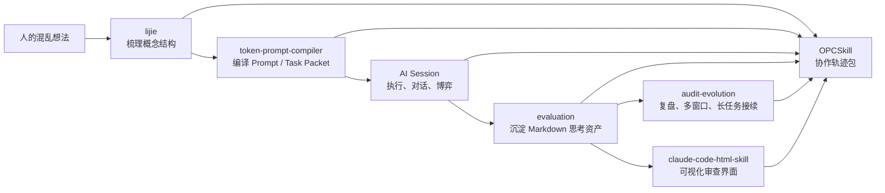

# Hotel A Founder Decision Ledger Demo

这个目录是一个公开安全的 OPCSkill demo。它展示的不是“AI worklog 很多”，而是一个更基础的工作流：

```text
人类发起任务，先有混乱想法和判断压力。
然后不同 skill 分阶段帮助人理解、编译、执行、沉淀、接续和可视化。
OPCSkill 最后把这些阶段汇总成可复用资产。
```

## 五步协作闭环



## 协作轨迹包

- [collaboration-trace.zh.md](collaboration-trace.zh.md)

这个 trace 说明每个 skill 的输入、动作、输出，以及 OPCSkill 最终保留什么。

## 实战产物

| 文件 | 角色 | 对应 skill |
|---|---|---|
| [00-source-inventory.zh.md](00-source-inventory.zh.md) | 样本来源索引，说明用了哪些材料、哪些不能公开 | `OPCSkill`、`audit-evolution` |
| [01-redacted-demo-source.zh.md](01-redacted-demo-source.zh.md) | 公开安全的源材料摘录 | `OPCSkill` |
| [02-dialogue-asset-founder-decision-ledger.zh.md](02-dialogue-asset-founder-decision-ledger.zh.md) | 核心 Markdown 资产，长期真源 | `OPCSkill`、`evaluation` |
| [03-readme-demo-section.zh.md](03-readme-demo-section.zh.md) | README 里的 3 分钟案例说明 | `evaluation`、`lijie` |
| [04-visual-export-plan.zh.md](04-visual-export-plan.zh.md) | 给 HTML skill 的视觉导出任务书 | `token-prompt-compiler`、`claude-code-html-skill` |
| `private-source-map.local.zh.md` | 本地私有证据映射，不发布 | `OPCSkill`、`audit-evolution` |

## 边界

- Markdown 是长期真源。
- HTML 只是审查、对照和展示界面。
- Companion skills 是可选加速器，不是 OPCSkill 的硬依赖。
- 本 demo 不声称已经实现 RAG、training、full batch cleaning 或自动化生产流水线。
- 本 demo 不包含私有 source map、本地路径、客户真实名称、联系方式或密钥。
